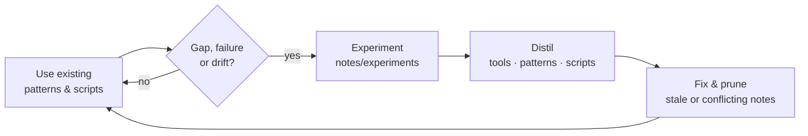

# toybox

**A knowledge engine for generating media with agents, from a single texture to a complete game.**

toybox collects the tools, models, scripts and working patterns that let an agent, directed by a human, produce images, audio, 3D assets, video and playable games. The knowledge is not written up front. It builds up through use: agents apply what is here, experiment where it runs out, and fold what works back in. Each session should leave the repo more capable and more accurate than it found it.

## How knowledge grows



- **Experiments** record what was tried, with exact commands and versions.
- **Tool notes** say how to drive one tool or model family, and what breaks.
- **Patterns** are proven, repeatable recipes that combine tools to produce a kind of media.
- **Scripts** are the reusable glue behind those patterns, with stable interfaces.

Everything is written by agents, for agents and humans. [`AGENTS.md`](AGENTS.md) explains how to contribute.

## Principles

- **Verified over plausible.** Claims trace back to something that was run, on a stated version. Untested claims are marked as such.
- **Current over complete.** Stale, contradictory or superseded knowledge is fixed or removed, not left to pile up.
- **CLI first.** Tools are driven from the shell and scripts (`blender -b -P …`, `unity …`, `mflux-*`). MCP servers are optional.
- **Local and native.** Run on the user's machine where possible, using the platform's acceleration (MLX, CUDA/TensorRT, ROCm) behind one stable interface per capability ([platforms](notes/platforms.md)).
- **Open formats, clear provenance.** Stages exchange GLB, PNG/EXR and WAV/OGG files. Every generated asset records its prompt, model, seed and licence.
- **Shippable by default.** Prefer models whose licences allow commercial use. Flag the ones that don't.

## First target: games

The most demanding use case, and the one we're building toward, is a full game pipeline:

```
                         Agent
              ┌────────────┼──────────────┐
            shell        shell          shell / HTTP
              │            │               │
         Blender CLI   Unity CLI     Generative models
         Python/bpy    Pipeline pkg  image · audio · LLM
              │            │               │
        3D assets ───► assemble/run/ ◄── textures, skies,
                        test game         sfx, music
```

See [`notes/pipeline.md`](notes/pipeline.md) for stages, hand-offs and formats.

## Map

| Path | Contents |
|------|----------|
| [`AGENTS.md`](AGENTS.md) | **Start here if you are an agent.** Conventions and how to contribute. |
| [`notes/patterns/`](notes/patterns/) | Proven recipes for producing a kind of media. |
| [`notes/tools/`](notes/tools/) | One note per tool or model family: usage, gotchas, verified status. |
| [`notes/pipeline.md`](notes/pipeline.md) | The end-to-end game pipeline. |
| [`notes/platforms.md`](notes/platforms.md) | Machine profile and backends per platform. |
| [`notes/experiments/`](notes/experiments/) | Dated logs: the evidence behind everything else. |
| [`notes/backlog.md`](notes/backlog.md) | Open questions and next experiments. |
| [`scripts/`](scripts/) | Generation wrappers, setup, Blender and Unity helpers. |

## Quick start (Apple Silicon)

```sh
scripts/setup/macos.sh    # Blender, uv, ffmpeg, MFLUX, Stable Audio 3 MLX
python3 scripts/gen/image.py --prompt "mossy cobblestone texture" --width 512 --height 512 --out out/tex.png
python3 scripts/gen/audio.py --kind sfx --prompt "coin pickup chime" --seconds 1.5 --out out/sfx_coin.wav
```

## Status

Development machine: Apple M4 Max, 128 GB unified memory.

| Capability | Tool(s) | Status |
|------------|---------|--------|
| Images, textures, backgrounds | MFLUX · FLUX.2 Klein 4B (default); Qwen-Image-2.1 for in-image text (non-commercial) | 🟢 macOS · ⚪ other platforms |
| SFX, music | Stable Audio 3 MLX `sa3` | 🟢 macOS · 🟡 NVIDIA (TensorRT) |
| 3D modelling | Blender (bpy, procedural scenes, headless Cycles/Metal) | 🟢 scene + render + rig hand-off + idle/walk study · ⚪ production animation |
| Game engine | Unity editor batch mode; CLI + Pipeline candidates | 🟢 FBX animation, measured locomotion, click-to-move + native macOS prototype · ⚪ Pipeline |
| Local LLM | Ollama (MLX models); oMLX candidate | 🟡 installed, not yet used in pipeline |
| Video | FFmpeg | 🟢 motion-review encoding · ⚪ generative video |
| Asset storage, collaboration | Private `toybox-assets` library · GitHub + Git LFS; per-game repos later | 🟢 upload/restore · ⚪ Unity collaboration ([notes](notes/tools/asset-storage.md)) |
| Publishing | Unity BuildPipeline | 🟡 local macOS arm64 build · ⚪ distribution/store pipeline |

🟢 verified in an experiment · 🟡 partially known · ⚪ not yet explored · 🔴 known broken

## License

The notes and scripts in this repo are available under the [MIT License](LICENSE). The third-party tools and model weights it refers to are not included, and each has its own licence. Some are non-commercial (see the tool notes). This licence does not override those terms, or the terms that govern generated output.
