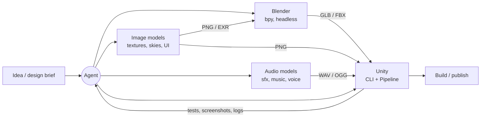

# Pipeline overview

The target is a pipeline where an agent, directed by a human, can take a game idea from concept to a published build by orchestrating local apps and generative models.

## Stages

| Stage | Responsibility | Primary tool | Output format | Notes |
|-------|----------------|--------------|---------------|-------|
| Concept | Design brief, style guide, concept art, asset list | Agent + human | Markdown, PNG sets | Asset list drives everything downstream. Concept art: [pattern](patterns/concept-art-exploration.md). |
| 3D assets | Model, UV, material, rig, animate | Blender | `.blend` source; `.glb` / `.fbx` for hand-off | [Showcase](patterns/reference-to-blender-showcase.md) and [diagnostic FBX rig hand-off](experiments/2026-09-24-blender-unity-rig-handoff.md) verified; production locomotion remains unverified. |
| 2D assets | Textures, PBR maps, backgrounds, skyboxes, sprites, UI | `scripts/gen/image.py` (MFLUX on macOS), Blender bakes | `.png`, `.exr` | [tools/image-generation.md](tools/image-generation.md) |
| Audio | SFX, ambience, music, voice | `scripts/gen/audio.py` (Stable Audio 3 on macOS), `ffmpeg` | `.wav` (source), `.ogg` | [tools/audio-generation.md](tools/audio-generation.md) |
| Language helpers | Prompt variants, naming, captioning / QA | Ollama / oMLX | text / JSON | [tools/local-llm.md](tools/local-llm.md) |
| Assembly | Import, scenes, prefabs, scripts, gameplay | Unity | Unity project | [tools/unity.md](tools/unity.md) |
| Test | Edit/PlayMode tests, screenshots, log inspection | Unity CLI | Test reports, images | Closes the loop so the agent can *see* results. |
| Publish | Build targets, packaging, distribution | Unity CLI (`unity build`) + TBD | Platform builds | Not started. |

## Hand-off contracts (proposed)

These are the defaults until an experiment shows a better choice.

- **Units & axes:** metres; verify exporter and importer together using one-metre markers. Tested FBX settings map Blender `(x, y, z)` to Unity `(x, z, y)`: a character facing Blender -Y faces Unity -Z. Do not assume Unity +Z-facing; a future controller/prefab needs an explicit facing convention.
- **Meshes:** FBX for the verified Unity rig/animation hand-off (built-in importer, no extra package). GLB with embedded textures remains a candidate for simple assets; Unity glTF import is still unverified.
- **Textures:** PNG, power-of-two, sRGB for colour, linear for data maps (normal, roughness, metallic, AO).
- **Audio:** WAV source (Stable Audio 3 emits 44.1 kHz stereo 16-bit; keep native rate unless Unity needs otherwise); loudness-normalised; loops trimmed on zero crossings.
- **Naming:** `snake_case`, prefixed by type: `mdl_`, `tex_`, `sfx_`, `mus_`, `sky_`.
- **Provenance:** every generated asset gets an `<asset>.json` sidecar (prompt, seed, params, backend, model, licence, versions, platform, exact command, timing). The `scripts/gen/` wrappers write it automatically.
- **Platform independence:** stages call capability wrappers, not backend tools directly, so the same pipeline runs on MLX, CUDA or ROCm backends ([platforms.md](platforms.md)).
- **Storage:** project assets and full briefs never go in this repo. Selected experiments live in the private `toybox-assets` library with Git LFS; approved production assets go in private per-game repos. Disposable output stays in local `out/`; private object storage is deferred until volume warrants it ([tools/asset-storage.md](tools/asset-storage.md)).

## The feedback loop

The key to agent-driven development is that the agent can **observe** results, not just produce them:

- Blender: render preview images headlessly and inspect them.
- Unity: run tests, capture screenshots / play-mode frames, read editor logs.
- Audio: inspect waveforms/spectrograms or measure loudness/duration.

Each tool note should document how to get that feedback.
