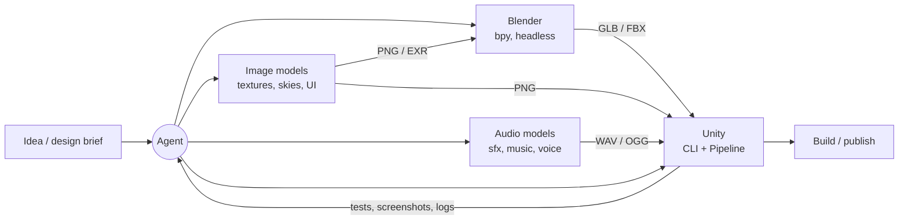

# Pipeline overview

The target is a pipeline where an agent, directed by a human, can take a game idea from concept to a published build by orchestrating local apps and generative models.

## Stages

| Stage | Responsibility | Primary tool | Output format | Notes |
|-------|----------------|--------------|---------------|-------|
| Concept | Design brief, style guide, concept art, asset list | Agent + human | Markdown, PNG sets | Asset list drives everything downstream. Concept art: [pattern](patterns/concept-art-exploration.md). |
| 3D assets | Model, UV, material, rig, animate | Blender | `.blend` source; `.glb` / `.fbx` for hand-off | [Showcase](patterns/reference-to-blender-showcase.md), [rig hand-off](experiments/2026-09-24-blender-unity-rig-handoff.md) and [first idle/walk study](experiments/2026-09-24-idle-walk-motion-study.md) verified; production animation remains open. |
| 2D assets | Textures, PBR maps, backgrounds, skyboxes, sprites, UI | `scripts/gen/image.py` (MFLUX on macOS), Blender bakes | `.png`, `.exr` | [tools/image-generation.md](tools/image-generation.md) |
| Audio | SFX, ambience, music, voice | `scripts/gen/audio.py` (Stable Audio 3 on macOS), `ffmpeg` | `.wav` (source), `.ogg` | [tools/audio-generation.md](tools/audio-generation.md) |
| Language helpers | Prompt variants, naming, captioning / QA | Ollama / oMLX | text / JSON | [tools/local-llm.md](tools/local-llm.md) |
| Assembly | Import, scenes, prefabs, scripts, gameplay | Unity | Unity project | [Click-to-move](experiments/2026-09-24-click-to-move.md) plus [detailed geometry/material transfer](experiments/2026-09-24-static-scene-unity.md); realtime look and shipping budgets remain separate. [tools/unity.md](tools/unity.md) |
| Test | Edit/PlayMode tests, screenshots, log inspection | Unity CLI | Test reports, images | Closes the loop so the agent can *see* results. |
| Publish | Build targets, packaging, distribution | Unity editor `BuildPipeline`; CLI candidate | Platform builds | Local macOS arm64 prototype and cache-free rebuild verified; signing, distribution and other targets open. |

## Hand-off contracts (proposed)

These are the defaults until an experiment shows a better choice.

- **Units & axes:** metres; verify exporter and importer together using one-metre markers. Tested FBX settings map Blender `(x, y, z)` to Unity `(x, z, y)`: a character facing Blender -Y faces Unity -Z. The motion study uses a 180-degree Y rotation on the visual child under a +Z locomotion parent; no hidden negative scale.
- **Animation:** in-place clips plus code-driven translation for the first study. Match translation speed to stance-foot travel; measure stance drift in world space, foot clearance and loop endpoints, including samples between authored keys. No foot-contact guarantee on slopes or during blends yet.
- **Meshes:** FBX for the verified Unity rig/animation hand-off (built-in importer, no extra package). GLB with embedded textures remains a candidate for simple assets; Unity glTF import is still unverified.
- **Textures:** PNG, power-of-two, sRGB for colour, linear for data maps (normal, roughness, metallic, AO).
- **Audio:** WAV source (Stable Audio 3 emits 44.1 kHz stereo 16-bit; keep native rate unless Unity needs otherwise); loudness-normalised; loops trimmed on zero crossings.
- **Naming:** `snake_case`, prefixed by type: `mdl_`, `tex_`, `sfx_`, `mus_`, `sky_`.
- **Provenance:** every generated asset gets an `<asset>.json` sidecar (prompt, seed, params, backend, model, licence, versions, platform, exact command, timing). The `scripts/gen/` wrappers write it automatically.
- **Platform independence:** stages call capability wrappers, not backend tools directly, so the same pipeline runs on MLX, CUDA or ROCm backends ([platforms.md](platforms.md)).
- **Storage:** project assets and full briefs never go in this repo. Selected experiments live in the private `toybox-assets` library with Git LFS; approved production assets go in private per-game repos. Disposable output stays in local `out/`; private object storage is deferred until volume warrants it ([tools/asset-storage.md](tools/asset-storage.md)).

## The feedback loop

The key to agent-driven development is that the agent can **observe** results, not just produce them:

- Blender: render preview images headlessly and inspect them.
- Unity: run tests, capture screenshots / play-mode frames, read editor logs.
- Audio: inspect waveforms/spectrograms or measure loudness/duration.

Each tool note should document how to get that feedback.

## First playable prototype: effort and token retrospective (2026-09-24)

This is a **rough accounting of one agent-guided run**, from local concept exploration through a detailed playable Unity scene, not a forecast for future projects. Active time was reconstructed from session timestamps and assigned to phases; user-response waits, overnight gaps, tool installation/downloads and obvious stalled Unity CLI waits were excluded. Validation, fixes and milestone archiving are included in their phases. Times are rounded, and the agent token figures come from the session usage ledger, not from the local image models.

| Phase | Active time | Agent input/cache writes | Agent output | Hypothetical GPT-6 Astra API cost |
|-------|------------:|-------------------------:|-------------:|----------------------------------:|
| [Concept art](experiments/2026-09-23-concept-art.md): prompts, probes, batches, review | ~30 min | 533k | 33k | ~$12.59 |
| [Blender modelling](experiments/2026-09-23-blender-showcase.md): scene, materials, character, renders | ~25 min | 213k | 40k | ~$8.91 |
| [Rig/export hand-off](experiments/2026-09-24-blender-unity-rig-handoff.md): skinning, axes, FBX validation | ~17 min | 126k | 47k | ~$9.86 |
| [Idle/walk animation](experiments/2026-09-24-idle-walk-motion-study.md): authoring, contact, playback | ~17 min | 343k | 35k | ~$11.36 |
| [Unity player control](experiments/2026-09-24-click-to-move.md): navigation, transitions, native build | ~18 min | 270k | 46k | ~$9.65 |
| [Unity detailed scene](experiments/2026-09-24-static-scene-unity.md): geometry, bakes, reflections, faster walk | ~23 min | 204k | 51k | ~$9.98 |
| [Private storage](experiments/2026-09-23-private-asset-library.md), review tooling, planning and notes | ~15 min | 684k | 36k | ~$14.68 |
| **Total** | **~2 h 25 min** | **~2.37M** | **~288k** | **~$77** |

Unity implementation accounts for ~41 minutes in the two Unity rows, **excluding** rig hand-off and animation. The token table omits approximately **32.96M cached input reads**; those reads still affect the hypothetical cost. The combined final row merges ~9 minutes / 208k input / 24k output of storage and review with ~6 minutes / 476k input / 12k output of planning and knowledge-base work. Output tokens include reasoning, not only delivered code.

The last column prices the **recorded token volumes and cache pattern as if every agent turn had used GPT-6 Astra High** at [OpenAI's Standard short-context API rates](https://developers.openai.com/api/docs/pricing), checked 2026-09-24: per million tokens, $1 cached reads, $12.50 cache writes, $50 output (including reasoning), and $10 other uncached input. With unrounded ledger counts, the approximate components are $32.96 reads + $29.65 writes + $14.42 output + less than $0.01 other input = **~$77.04**. Phase costs and token counts above are rounded independently. This is **not an invoice**: some work used a different agent model, and changing models could change token use and caching. It excludes local image-generation compute, electricity, storage and possible tool charges.

Machine execution and agent work are different clocks: 30 Klein images took ~9.4 minutes and three Qwen images ~16.1 minutes; four final Blender renders took ~78 seconds combined; the detailed geometry export and texture bake took ~32 seconds. Do not add these runtimes to the phase totals or generalize them as controlled performance benchmarks.
